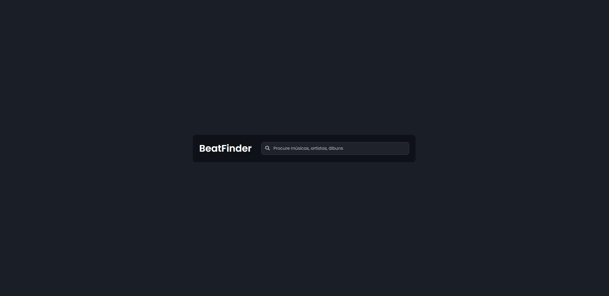

# 🎵 BeatFinder

Um buscador de músicas simples e direto, feito com HTML, CSS e JavaScript puro, utilizando a API da Deezer. Digite o nome de uma música, artista ou banda e ouça um trecho da faixa direto no navegador!

🔗 **Acesse o projeto online:** [GitHub Pages](https://endriusssantos.github.io/beatfinder)

---

## ✨ Funcionalidades

- 🔎 Busca por Músicas, Artistas e Álbuns: Pesquise músicas, artistas ou álbuns com base em seus nomes.
- ▶️ Player de Prévia: Ouça um trecho de 30 segundos da música usando a API do Apple Music.
- 🔄 Play/Pause Inteligente: Toca uma música por vez. Ao clicar em outra, a anterior é pausada automaticamente.
- ⏳ Loader de Carregamento: Indica quando os dados estão sendo buscados.
- 📱 Responsivo: Interface adaptável para dispositivos móveis e desktops.
- 📭 Tratamento de Erros: Feedback amigável caso nenhuma música seja encontrada.

---

## 🛠️ Tecnologias Utilizadas

- **HTML5**
- **CSS3**
  - Estilização com foco em simplicidade e legibilidade
- **JavaScript (Vanilla)**
  - Manipulação de DOM
  - Fetch com async/await
  - Integração com a API pública do Apple Music

---

## 📂 Estrutura de Pastas

```
beatfinder/
├── index.html
└── src/
    ├── css/
    │   ├── reset.css
    │   └── style.css
    |   └── responsive.css
    └── js/
        └── index.js
```

---

## 🚀 Como Rodar o Projeto

1. Clone o repositório:

```bash
git clone https://github.com/endriusssantos/beatfinder
cd beatfinder
```

2. Abra o arquivo index.html em seu navegador, ou use uma extensão como "Live Server" no VSCode.

---

## 💡 Possíveis Melhorias Futuras

- ⭐ Adicionar sistema de favoritos com localStorage
- 📈 Exibir ranking com músicas populares
- 🎵 Botão para controle do volume e duração da música
---

## 📸 Preview



---

## 🧑‍💻 Autor

Feito com 💙 por Endrius da Silva dos Santos
